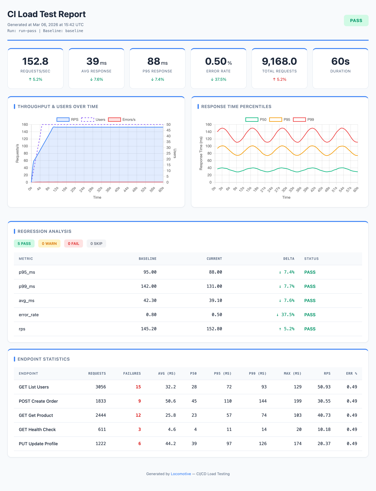
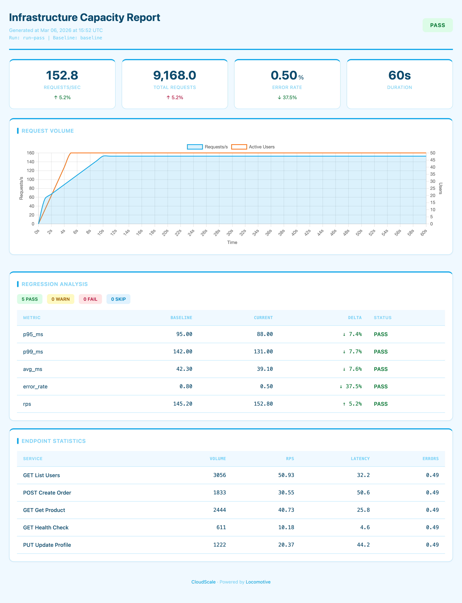
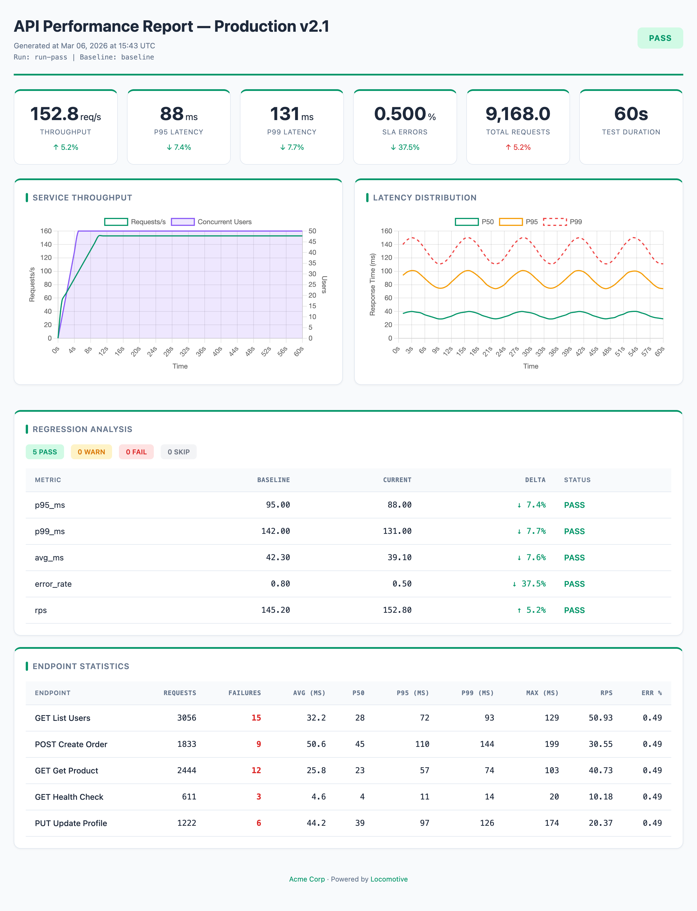
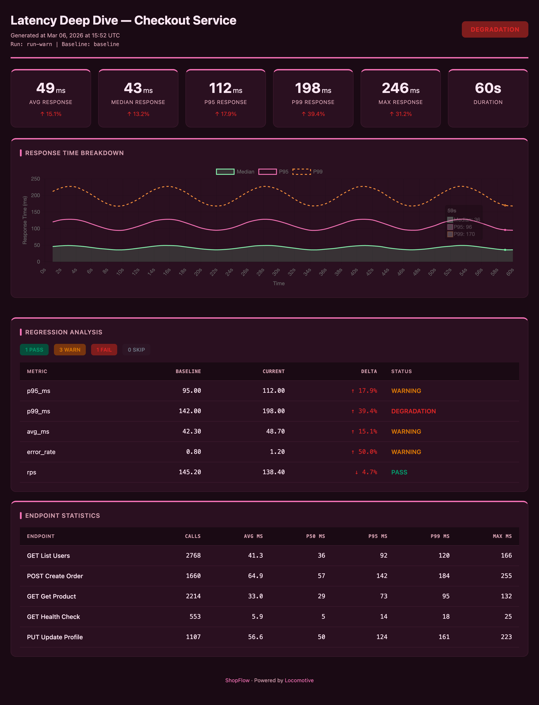
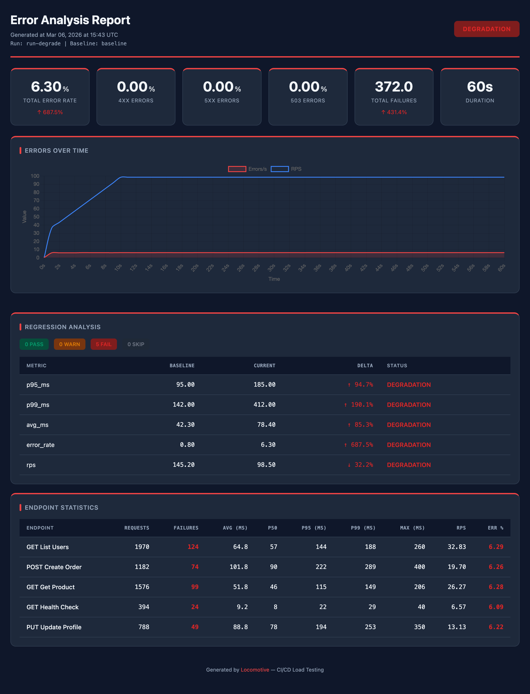
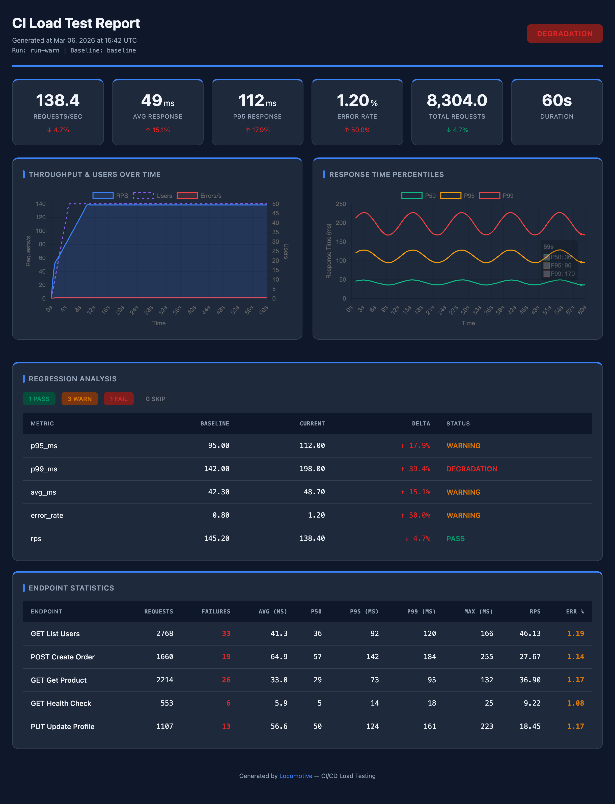
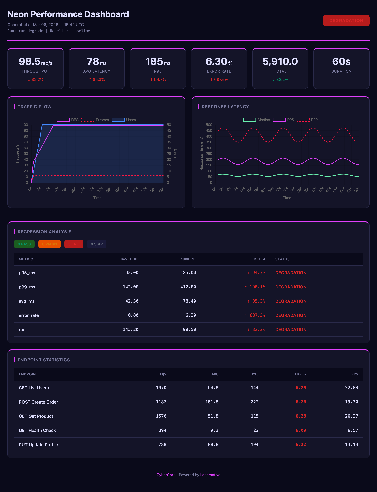
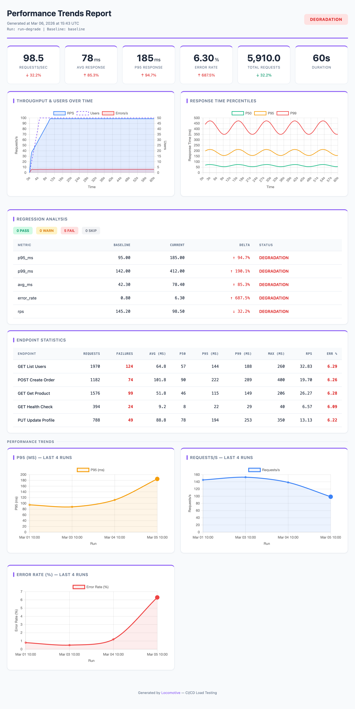

# Locomotive — CI Load Testing Library

[](https://github.com/locomotive-lib/locomotive/actions/workflows/tests.yml)
[](https://pypi.org/project/locomotive/)
[](https://pypi.org/project/locomotive/)
[](LICENSE)

A Python library and CLI for integrating load testing into CI/CD pipelines. Powered by Locust under the hood, but lets you define tests declaratively in JSON/YAML config — no Python code required. Generates HTML reports with charts, regression analysis and baseline comparison, with full theming and branding support.




## Features

- **OpenAPI generation** — `loco init --openapi openapi.json` scaffolds a config from your API spec
- **Baseline comparison** — regression analysis of performance metrics across runs
- **Gate checks** — threshold-based metric validation (error rate, latency, RPS)
- **HTML reports** — visual results with charts, deltas, and customizable themes
- **GitHub Actions ready** — built-in Action for CI/CD integration, PR comments, artifact uploads, and pipeline gating
- **YAML & JSON configs** — both formats supported (`.json`, `.yml`, `.yaml`)

## Installation

```bash
pip install locomotive
```

Locust is installed automatically as a dependency.

## Quick Start

### 1. Create a config

```bash
# Basic template
loco init

# Generate from OpenAPI spec (creates requests from endpoints)
loco init --openapi openapi.json

# Also generate a GitHub Actions workflow
loco init --github-workflow
```

| Flag | Description |
|------|-------------|
| `--openapi FILE` | Path to OpenAPI spec — endpoints will be converted to requests |
| `--host URL` | Service URL (default: `http://localhost:8000`) |
| `--output FILE` / `-o` | Output file path (default: `loconfig.json`) |
| `--github-workflow` | Also create `.github/workflows/loadtest.yml` |
| `--force` / `-f` | Overwrite existing files |

### 2. Configure

Edit `loconfig.json` to match your service:

```jsonc
{
  "load": {
    "host": "https://staging.myapp.com",     // target service URL
    "users": 500,                             // number of virtual users
    "spawn_rate": 50,                         // user spawn rate (per second)
    "run_time": "3m"                          // test duration (s/m/h)
  },
  "scenario": {
    "think_time": {"min": 0.5, "max": 2.0},  // pause between requests (simulates real users)
    "headers": {
      "Accept": "application/json"
    },
    "requests": [
      {
        "name": "Get Users",
        "method": "GET",
        "path": "/api/users",
        "weight": 5                           // relative call frequency (higher = more frequent)
      },
      {
        "name": "Create Order",
        "method": "POST",
        "path": "/api/orders",
        "weight": 2,
        "json": {"product_id": 1, "quantity": "${random}"}
      }
    ]
  }
}
```

### 3. Run

```bash
# Full CI pipeline: test → analyze → report
loco --config loconfig.json ci

# Save baseline for future comparisons
loco --config loconfig.json ci --set-baseline
```

## Configuration

### `load` section

Load test parameters. Fields `host`, `users`, `spawn_rate`, and `run_time` are required.

```jsonc
{
  "load": {
    "host": "https://staging.myapp.com",     // required: target service URL
    "users": 500,                             // required: number of virtual users
    "spawn_rate": 50,                         // required: users/sec ramp-up rate
    "run_time": "3m",                         // required: duration ("30s", "2m", "1h")
    "stop_timeout": 10,                       // graceful shutdown timeout in seconds
    "tags": ["api"],                          // only run requests tagged "api"
    "exclude_tags": ["slow"]                  // skip requests tagged "slow"
  }
}
```

### `scenario` section

User scenario definition: headers, auth, and requests.

```jsonc
{
  "scenario": {
    "think_time": {"min": 0.5, "max": 2.0},  // pause between requests (or a number: "think_time": 1.0)
    "headers": {                               // global headers for all requests
      "Accept": "application/json",
      "Content-Type": "application/json"
    },
    "auth": {                                  // authentication (see section below)
      "type": "bearer",
      "token": "${API_TOKEN}"                  // environment variable
    },
    "on_start": [                              // runs once per user at startup
      {
        "name": "Login",
        "method": "POST",
        "path": "/auth/login",
        "json": {"username": "${USER}", "password": "${PASS}"},
        "capture": {"auth_token": "data.token"}
      }
    ],
    "requests": [...]                          // request array (see below)
  }
}
```

### Request format

Each request in the `requests` array describes a single HTTP call:

```jsonc
{
  "name": "Create Resource",                   // display name for reports (default: "METHOD /path")
  "method": "POST",                            // HTTP method: GET, POST, PUT, PATCH, DELETE
  "path": "/api/resources",                    // path (appended to host)
  "weight": 3,                                 // relative call frequency (default: 1)
  "headers": {"X-Custom": "value"},            // per-request headers
  "query": {"filter": "active"},               // query parameters (?filter=active)
  "json": {"field": "value"},                  // JSON request body
  "data": {"field": "value"},                  // form-encoded request body (alternative to json)
  "timeout": 30,                               // timeout in seconds
  "tags": ["api", "write"]                     // tags for filtering
}
```

### Tags

Tags let you run a subset of requests. Assign `"tags": ["api", "write"]` to a request, then use `--tags api` to only run requests tagged `api`. Or `--exclude-tags slow` to run everything except requests tagged `slow`. Tags can also be set in the config: `"load": {"tags": ["api"]}`.

### Dynamic values

String values in the config support runtime placeholders — resolved at request time:

| Placeholder | Description |
|-------------|-------------|
| `${ENV_VAR}` | Environment variable |
| `$ENV_VAR` | Environment variable (short syntax) |
| `${ENV_VAR:-default}` | Environment variable with fallback |
| `${timestamp}` | Current timestamp in milliseconds |
| `${random}` | Random alphanumeric string (8 chars) |
| `${iteration}` | Request counter across the run: 1, 2, 3, ... — increments on every call by any virtual user. Useful for unique data: `"name": "user-${iteration}"` |

### Authentication

The `auth` section in `scenario` adds an auth header to all requests:

```jsonc
// Bearer token — adds Authorization: Bearer <token> header
"auth": {"type": "bearer", "token": "${API_TOKEN}"}

// API Key — adds a custom header with the key
"auth": {"type": "api_key", "header": "X-API-Key", "key": "${API_KEY}"}

// Basic Auth — adds Authorization: Basic <user>:<password> header
"auth": {"type": "basic", "username": "${USER}", "password": "${PASS}"}
```

### Capture (response data extraction)

In `on_start` requests, you can extract values from JSON responses and use them in subsequent requests. A typical use case is login: each virtual user POSTs to /login at startup, receives a token, and Locomotive automatically injects it into headers for all further requests.

Everything is configured declaratively — no need to edit the generated locustfile:

```jsonc
{
  "scenario": {
    "on_start": [
      {
        "name": "Login",
        "method": "POST",
        "path": "/auth/login",
        "json": {"username": "${USER}", "password": "${PASS}"},
        "capture": {
          "auth_token": "data.token"     // extracts response.json()["data"]["token"]
        }
      }
    ],
    "headers": {
      "Authorization": "Bearer ${auth_token}"  // injected automatically
    },
    "requests": [...]
  }
}
```

`capture` is a `{"variable_name": "json.path"}` dict. The path is dot-separated: `"data.token"` means `response["data"]["token"]`.

## Rules vs Gates

Locomotive provides two mechanisms for validating metrics:

| | **Rules** (regression analysis) | **Gates** (threshold checks) |
|---|---|---|
| **Compares** | Current run **vs baseline** (a run marked with `--set-baseline`) | Current run **vs fixed thresholds** |
| **Needs baseline** | Yes — requires a previous run with `--set-baseline` (otherwise SKIP) | No |
| **Use case** | Catch degradation: "p95 got 15% worse" | Enforce SLAs: "p95 must stay under 500ms" |
| **Example** | `"metric": "p95_ms", "mode": "relative", "fail": 25` | `"p95_ms": {"fail": 500}` |

Both can be used together — results are merged, and the overall status is the worst of the two.

## Baseline & Regression Analysis

**Baseline** is a saved result from a previous run used for comparison.

Baseline is saved when you pass `--set-baseline` (in the built-in Action this happens automatically — `set_baseline` defaults to `true`). Only successful runs (PASS or WARNING) are saved.

On the first run there is no baseline — regression analysis is skipped (but gate checks still work). Starting from the second successful run, the report shows deltas: how much latency, RPS, and error rate changed compared to the previous run.

### Analysis rules

Rules compare current metrics against baseline and produce a status:

```jsonc
{
  "analysis": {
    "rules": [
      {
        "metric": "p95_ms",        // metric to check
        "mode": "relative",        // "relative" (% change) or "absolute" (raw value)
        "direction": "increase",   // p95 increase = degradation
        "warn": 10,                // WARNING if p95 increased by 10%
        "fail": 25                 // DEGRADATION if p95 increased by 25%
      },
      {
        "metric": "error_rate",
        "mode": "absolute",        // checks the raw error_rate value (not delta)
        "direction": "increase",   // error_rate increase = degradation
        "warn": 1,                 // WARNING if error_rate >= 1%
        "fail": 5                  // DEGRADATION if error_rate >= 5%
      },
      {
        "metric": "rps",
        "mode": "relative",
        "direction": "decrease",   // RPS drop = degradation
        "warn": 10,                // WARNING if RPS dropped by 10%
        "fail": 20                 // DEGRADATION if RPS dropped by 20%
      }
    ],
    "fail_on": "DEGRADATION"       // exit code 1 on this status ("WARNING" = stricter)
  }
}
```

Rules can be extracted to a separate file:

```jsonc
{
  "analysis": {
    "rules_file": "rules.json"     // path to a file with a rules array
  }
}
```

| Parameter | Description | Values |
|-----------|-------------|--------|
| `metric` | Metric to check | `p95_ms`, `p99_ms`, `avg_ms`, `median_ms`, `rps`, `error_rate` |
| `mode` | Comparison type | `relative` — % change from baseline; `absolute` — raw metric value compared to threshold |
| `direction` | Which direction is degradation | `increase` — degradation on growth (latency, errors); `decrease` — degradation on drop (rps) |
| `warn` / `fail` | Thresholds | Exceeding `warn` → WARNING, `fail` → DEGRADATION |
| `fail_on` | When CI should fail | `"DEGRADATION"` (default) or `"WARNING"` (stricter) |

### Statuses

| Status | Meaning | Exit code |
|--------|---------|-----------|
| **PASS** | Metric is within acceptable range | 0 |
| **WARNING** | Minor deviation (exceeded `warn`) | 0 (or 1 if `fail_on: "WARNING"`) |
| **DEGRADATION** | Significant degradation (exceeded `fail`) | 1 |
| **SKIP** | Insufficient data: no baseline or request count below `gate.min_requests` | 0 |

## Gate Checks

Gate checks work **without a baseline** — they validate absolute metric values against fixed thresholds. Use them to enforce SLAs: "error rate under 5%", "p95 under 500ms".

Thresholds define boundaries: if a metric exceeds `warn` — WARNING, `fail` — DEGRADATION.

Each threshold has a `direction` — which way is bad. Default is `"increase"` (higher = worse), for `rps` use `"decrease"` (lower = worse). Example: `"rps": {"fail": 100, "direction": "decrease"}` — fails if RPS drops below 100.

For error metrics (`error_rate`, `failures`, etc.) `warn: 0` is set automatically — any errors below `fail` result in WARNING instead of PASS.

```jsonc
{
  "analysis": {
    "gate": {
      "min_requests": 200,                     // minimum requests for check (otherwise SKIP)
      "warmup_seconds": 10,                    // first N seconds are excluded
      "thresholds": {
        "error_rate": {"fail": 5},             // total error rate < 5% (warn = 0 auto)
        "error_rate_503": {"fail": 2},         // 503 errors < 2%
        "p95_ms": {"warn": 300, "fail": 500},  // p95 latency
        "rps": {"fail": 100, "direction": "decrease"}  // RPS not below 100
      }
    }
  }
}
```

### Available metrics for threshold checks

Thresholds can be specified as objects `{"warn": N, "fail": M}` or shorthand numbers — `"error_rate": 5` is equivalent to `"error_rate": {"fail": 5}`.

**Error rates:**

| Metric | Description |
|--------|-------------|
| `error_rate` | Total error percentage |
| `error_rate_4xx` | 4xx error percentage |
| `error_rate_5xx` | 5xx error percentage |
| `error_rate_503` | 503 error percentage |
| `error_rate_non_503` | Non-503 error percentage (graceful degradation) |

**Absolute error counts:**

| Metric | Description |
|--------|-------------|
| `failures` | Total failure count |
| `failures_4xx` | 4xx failure count |
| `failures_5xx` | 5xx failure count |
| `failures_503` | 503 failure count |
| `failures_non_503` | Non-503 failure count |

**Latency & throughput:**

| Metric | Description |
|--------|-------------|
| `avg_ms` | Average response time |
| `median_ms` | Median response time |
| `p95_ms` | 95th percentile |
| `p99_ms` | 99th percentile |
| `rps` | Requests per second (use `"direction": "decrease"`) |

## `artifacts` section

Result storage settings:

```jsonc
{
  "artifacts": {
    "storage": "artifacts",              // artifact storage directory (default: "artifacts")
    "run_id": "${GITHUB_SHA:-local}",    // run ID; in CI resolves to commit SHA, locally — "local"
    "history": 30                        // number of recent runs to keep for trend charts (0 = disabled)
  }
}
```

| Parameter | Default | Description |
|-----------|---------|-------------|
| `storage` | `"artifacts"` | Artifact directory path |
| `run_id` | timestamp | Run ID; defaults to `run-<timestamp>`, in CI resolves to `GITHUB_SHA` / `GITHUB_RUN_ID` / `CI_PIPELINE_ID` |
| `history` | `0` (disabled) | Number of runs in `history.json` for trend charts; `0` disables history tracking |

## GitHub Actions

### Recommended approach (pip install)

Locomotive is available on the public PyPI registry.

```yaml
name: Load Test

on:
  push:
    branches: [main]
  pull_request:

jobs:
  loadtest:
    runs-on: ubuntu-latest
    steps:
      - uses: actions/checkout@v4

      - name: Set up Python
        uses: actions/setup-python@v5
        with:
          python-version: '3.12'

      - name: Install
        run: pip install locomotive

      - name: Start service
        run: docker-compose up -d
        # or however you start your service

      - name: Run load test
        run: loco --config loconfig.json ci --set-baseline
        env:
          API_TOKEN: ${{ secrets.API_TOKEN }}  # if auth is needed

      - name: Upload results
        uses: actions/upload-artifact@v4
        if: always()
        with:
          name: loadtest-results
          path: artifacts/
```

### Built-in Action (with HTML reports, PR comments, and artifacts)

Locomotive ships with a GitHub Action that handles everything: installation, test execution, HTML report generation, baseline management, and artifact uploads.

```yaml
name: Load Test

on:
  push:
    branches: [main]
  pull_request:

jobs:
  loadtest:
    runs-on: ubuntu-latest
    steps:
      - uses: actions/checkout@v4

      - name: Set up Python
        uses: actions/setup-python@v5
        with:
          python-version: '3.12'

      - name: Run load test
        uses: locomotive-lib/locomotive/.github/actions/loadtest@master
        with:
          config: loconfig.json
```

The Action automatically:
- Installs `locomotive` from PyPI
- Downloads baseline from previous runs
- Runs tests, analysis, and generates the HTML report
- Uploads the HTML report and all artifacts (metrics, analysis, CSV) to GitHub Actions Artifacts
- Saves baseline on successful runs (`set_baseline: true` by default)
- Posts a summary with metrics as a PR comment

Action parameters:

| Parameter | Default | Description |
|-----------|---------|-------------|
| `config` | `loconfig.json` | Config file path |
| `users` | from config | Override user count |
| `run_time` | from config | Override test duration |
| `set_baseline` | `true` | Save run as baseline on success |
| `post_pr_comment` | `true` | Post results as a PR comment |
| `baseline_artifact` | `loadtest-baseline` | Artifact name for baseline storage |
| `results_artifact` | `loadtest-results` | Artifact name for results |
| `github_token` | `github.token` | Token for PR comments. Uses the built-in `github.token` by default — no need to create a separate token |

Action outputs:

| Output | Description |
|--------|-------------|
| `metrics_path` | Path to `metrics.json` |
| `report_path` | Path to `report.html` |
| `status` | Run status: `PASS`, `WARNING`, or `DEGRADATION` |

## Report Customization

The `report` section in the config lets you customize the HTML report: theme, colors, branding, KPI cards, charts, endpoint table, and trends.

### Presets

The quickest way — pick a preset. A preset defines a set of KPI cards, charts, and trends. You can override any preset settings — your overrides take priority.

```jsonc
{
  "report": {
    "preset": "default"    // "default" | "latency" | "throughput" | "errors"
  }
}
```

| Preset | Focus | KPI cards | Charts |
|--------|-------|-----------|--------|
| `default` | Balanced overview | rps, avg_ms, p95_ms, error_rate, requests, duration | throughput + response_time |
| `latency` | Response time | avg, median, p95, p99, max, duration | response_time |
| `throughput` | Throughput | rps, requests, error_rate, duration | throughput |
| `errors` | Errors | error_rate, 4xx, 5xx, 503, failures, duration | throughput (titled "Errors Over Time", shows errors/s and RPS) |

<details>
<summary><b>Throughput</b> — <code>throughput</code> preset + custom pastel theme + branding</summary>


</details>

<details>
<summary><b>Branded</b> — default preset + custom KPI cards + branding + accent <code>#059669</code></summary>


</details>

<details>
<summary><b>Latency</b> — <code>latency</code> preset + custom dark theme + branding</summary>


</details>

<details>
<summary><b>Errors</b> — <code>errors</code> preset + dark theme, accent <code>#ef4444</code></summary>


</details>

All reports above are examples of customization on top of presets: theme, colors, branding, and card layout are configured in the `report` section.

### Theme & colors

By default, the report uses a light theme. To switch to dark mode, just set `"mode": "dark"` — no additional configuration needed:


*Default dark theme — only `"theme": {"mode": "dark"}`*

```jsonc
{
  "report": {
    "title": "Load Test Report — My Service",  // report title
    "output": "artifacts/report.html",          // HTML report path (default: inside run dir)
    "timezone": "UTC+3",                        // timezone: "UTC", "UTC+3", "UTC-5:30"
    "theme": {
      "mode": "light",                          // "light" or "dark"
      "color": "#6366f1"                        // accent color (shortcut for primary)
    }
  }
}
```

### Branding

Display your company or project name in the report footer:

```jsonc
{
  "report": {
    "branding": {
      "name": "CompanyName",              // name shown in the report footer
      "color": "#ffffff"                  // footer text color
    }
  }
}
```

### Full color control


*Fully custom theme: all CSS variables overridden, custom charts, branding, and endpoint table*

All theme CSS variables can be overridden:

```jsonc
{
  "report": {
    "theme": {
      "mode": "dark",
      "colors": {
        "primary": "#6366f1",       // accent color (card borders, header)
        "primary-light": "#818cf8", // lighter accent variant
        "bg": "#0f172a",            // page background
        "card": "#1e293b",          // card background
        "text": "#f8fafc",          // primary text
        "text-muted": "#94a3b8",    // secondary text
        "line": "#334155",          // lines and borders
        "pass-bg": "#166534",       // PASS status background
        "warn-bg": "#854d0e",       // WARNING status background
        "fail-bg": "#991b1b",       // DEGRADATION status background
        "skip-bg": "#374151"        // SKIP status background
      }
    }
  }
}
```

### KPI cards

Cards at the top of the report with key run metrics. Each card shows a metric value and delta against baseline (if available). You can customize which metrics to show, labels, number formatting, and units:

```jsonc
{
  "report": {
    "kpi": {
      "cards": [
        {"metric": "rps", "label": "Requests/sec", "format": "{value:.1f}"},
        {"metric": "p95_ms", "label": "P95 Latency", "format": "{value:.0f}", "unit": "ms"},
        {"metric": "error_rate", "label": "Errors", "format": "{value:.2f}", "unit": "%"},
        {"metric": "requests", "label": "Total", "format": "{value:,}"},
        {"metric": "duration", "label": "Duration", "format": "duration"}
      ]
    }
  }
}
```

| Field | Description |
|-------|-------------|
| `metric` | Metric key (`rps`, `avg_ms`, `p95_ms`, `p99_ms`, `error_rate`, `requests`, `duration`, etc.) |
| `label` | Card label |
| `format` | Python format string (`"{value:.2f}"`) or `"duration"` for auto time formatting |
| `unit` | Unit of measure (`"ms"`, `"%"`) |
| `multiplier` | Value multiplier before display (default: 1.0) |

### Charts

Two built-in charts: `throughput` (RPS, errors, users over time) and `response_time` (percentiles over time). You can enable/disable charts, change titles, and configure datasets (which lines to show, colors, axes):

```jsonc
{
  "report": {
    "charts": {
      "throughput": {
        "enabled": true,                // show chart (default: true)
        "title": "Throughput",          // chart title
        "datasets": [
          {"key": "rps", "label": "RPS", "color": "#3b82f6", "y_axis": "left"},
          {"key": "errors", "label": "Errors/s", "color": "#ef4444", "y_axis": "right", "dash": [5, 5]},
          {"key": "users", "label": "Users", "color": "#a855f7", "y_axis": "right", "fill": true}
        ]
      },
      "response_time": {
        "enabled": true,
        "title": "Response Time",
        "datasets": [
          {"key": "p50", "label": "Median", "color": "#22c55e"},
          {"key": "p95", "label": "P95", "color": "#f59e0b"},
          {"key": "p99", "label": "P99", "color": "#ef4444", "dash": [5, 5]}
        ]
      }
    }
  }
}
```

| Dataset field | Description |
|---------------|-------------|
| `key` | Data key: `rps`, `users`, `errors`, `p50`, `p95`, `p99` |
| `label` | Legend label |
| `color` | Line color (hex) |
| `y_axis` | Axis: `"left"` or `"right"` for dual scale |
| `fill` | `true` — fill area under the line |
| `dash` | Dashed line: `[length, gap]`, e.g. `[5, 5]` |

> In the `errors` preset, the `throughput` chart is titled "Errors Over Time" and configured to show errors/s and RPS. There is no separate "errors over time" chart type — it's a customized `throughput`.

### Endpoint table

Table at the bottom of the report with per-endpoint metrics (one row per `name` in `requests`). You can configure columns and set thresholds for cell highlighting — yellow for `warn`, red for `fail`:

```jsonc
{
  "report": {
    "endpoint_table": {
      "columns": [
        {"key": "name", "label": "Endpoint"},
        {"key": "requests", "label": "Requests"},
        {"key": "p95", "label": "P95", "highlight": {"warn": 300, "fail": 500}},
        {"key": "error_rate", "label": "Error %", "highlight": {"fail": 5}}
      ]
    }
  }
}
```

Available column keys: `name`, `requests`, `failures`, `avg`, `p50`, `p95`, `p99`, `max`, `rps`, `error_rate`.

### Sections & trends

Control which sections appear in the report and in what order:

```jsonc
{
  "report": {
    "sections": ["kpi", "charts", "regression", "endpoints", "trends"]
  }
}
```

By default: `kpi`, `charts`, `regression`, `endpoints`. The `trends` section is not included by default — it must be added explicitly.

**Trends** are additional charts showing how selected metrics changed across runs. For example, you can see that p95 latency has been gradually increasing over the last 20 runs. Requirements:
1. Add `"trends"` to `sections`
2. Set `artifacts.history` > 0 (how many runs to keep)
3. At least 2 runs in history

Configure which metrics to show on trend charts (each metric gets its own chart):

```jsonc
{
  "report": {
    "trends": {
      "metrics": ["p95_ms", "rps", "error_rate"]
    }
  }
}
```


*Trends section — metric changes across runs. Accent color `#8b5cf6`*

Available trend metrics: `rps`, `avg_ms`, `median_ms`, `p95_ms`, `p99_ms`, `max_ms`, `error_rate`, `error_rate_4xx`, `error_rate_5xx`, `error_rate_503`, `requests`, `failures`.

## CLI Reference

### `loco init` — create config

```bash
loco init [--openapi spec.json] [--host URL] [--github-workflow] [--output FILE] [--force]
```

| Flag | Description |
|------|-------------|
| `--openapi FILE` | Path to OpenAPI spec — endpoints will be converted to requests |
| `--host URL` | Service URL (default: `http://localhost:8000`) |
| `--output FILE` / `-o` | Output config path (default: `loconfig.json`) |
| `--github-workflow` | Also create `.github/workflows/loadtest.yml` |
| `--force` / `-f` | Overwrite existing files |

### `loco ci` — full pipeline

```bash
loco --config loconfig.json ci [--set-baseline] [--users N] [--run-time 3m] ...
```

Runs test → analysis → report. Accepts all flags from `run`, `analyze`, and `report`.

### `loco run` — run tests only

```bash
loco --config loconfig.json run [--storage DIR] [--run-id ID] [--set-baseline] [--users N] [--run-time 3m] ...
```

### `loco analyze` — run analysis only

```bash
loco --config loconfig.json analyze --storage DIR --run-id ID [--baseline <run_id>] [--fail-on DEGRADATION]
```

### `loco report` — generate report only

```bash
loco --config loconfig.json report --storage DIR --run-id ID [--baseline <run_id>] [--title "Title"] [--output report.html]
```

### Common flags

Flags available for all subcommands (`run`, `analyze`, `report`, `ci`):

| Flag | Description |
|------|-------------|
| `--storage` | Artifact directory |
| `--run-id` | Run ID |
| `--baseline` | Baseline run ID for comparison |

Additional `run` and `ci` flags:

| Flag | Description |
|------|-------------|
| `--host` | Override host URL |
| `--users` | Override user count |
| `--spawn-rate` | Override spawn rate |
| `--run-time` | Override test duration |
| `--tags` | Only run requests with specified tags (comma-separated) |
| `--exclude-tags` | Exclude requests with specified tags |
| `--locustfile` | Path to locustfile (instead of scenario) |
| `--set-baseline` | Save as baseline |
| `--extra-arg` | Extra Locust argument (can be specified multiple times) |
| `--locust-cmd` | Path to locust binary |

Additional `analyze` and `ci` flags:

| Flag | Description |
|------|-------------|
| `--rules` | Path to external analysis rules file |
| `--fail-on` | Exit code 1 threshold: `WARNING` or `DEGRADATION` |

Additional `report` and `ci` flags:

| Flag | Description |
|------|-------------|
| `--title` | HTML report title |
| `--output` | HTML report output path |

## Using an existing locustfile

If you have an existing locustfile, you can use it instead of `scenario`:

```jsonc
{
  "load": {
    "locustfile": "tests/locustfile.py",       // path to your locustfile
    "host": "https://staging.myapp.com",
    "users": 500,
    "spawn_rate": 50,
    "run_time": "3m"
  }
}
```

In this case, the `scenario` section is not needed — Locomotive uses your locustfile and adds analysis, reports, and gate checks on top.

## Artifacts

```
artifacts/
├── baseline.json           # current baseline run ID
├── history.json             # run history (for report trends)
└── runs/
    └── <run_id>/
        ├── run.json         # run metadata (time, config, commit)
        ├── metrics.json     # aggregated metrics
        ├── analysis.json    # analysis results (statuses, deltas)
        ├── report.html      # HTML report
        ├── generated/       # generated locustfile
        └── raw/             # raw Locust CSV files
```

## Requirements

- Python 3.9+

## License

MIT
